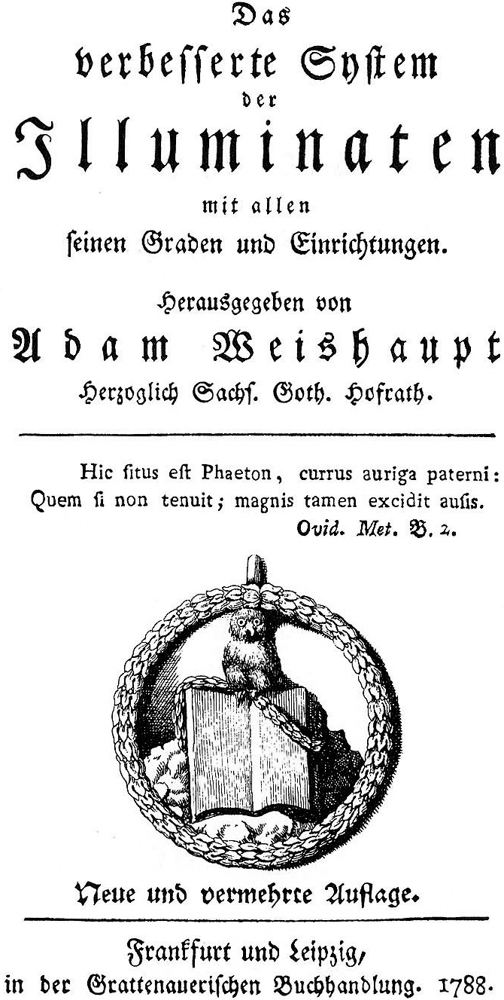
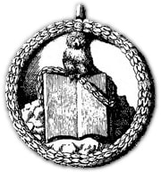

# Emblem och symboler — äkta bildmaterial

Detta dokument samlar **endast äkta, periodmässigt spårbart** bildmaterial som hör till den historiska orden. Allt modernt skräp — pyramider, allseende ögon, "666"-grafik och kändislogotyper som cirkulerat efter att originalorden försvann — är medvetet **uteslutet**. Se [[10-historia-vs-myt]] för varför den symboliken inte hör hit.

← Tillbaka till [[README]] · Se även [[04-organisation-och-grader]] · [[12-originaldokument]]

---

## Viktig sanning: orden hade ingen "logotyp"

Illuminatiorden hade **ingen enda officiell logotyp** i modern mening. Det bäst belagda emblemet är **Minervas uggla på en uppslagen bok** — Minerval-insignet — som symboliserar visdom (Minerva/Athena) och lärdom. Utöver det förekom enklare frimurerskt/klassiskt härledda tecken (punkt i cirkel m.m.). Det är allt som finns med säker periodförankring.

## Bevarade bilder i denna kunskapsbas

### 1. Minerval-insignet på titelsidan (1788)

- **Fil:** `bilder/minerval-insignia-1788.png`
- **Vad:** Titelsidan till Adam Weishaupts egen ***Das verbesserte System der Illuminaten mit allen seinen Graden und Einrichtungen*** (ny och utökad upplaga, Frankfurt & Leipzig, Grattenauerische Buchhandlung, **1788**). Nederst syns Minerval-emblemet: **ugglan sittande på en uppslagen bok, inramad av en lagerkrans.**
- **Latinskt motto på sidan:** Ovidius, *Metamorfoser* bok 2 — *"Hic situs est Phaeton, currus auriga paterni: Quem si non tenuit; magnis tamen excidit ausis"* ("Här vilar Faëton, som körde sin faders vagn; om han än inte förmådde styra den, föll han dock i ett storslaget vågstycke"). En anspelning på strävan efter stort trots risken att falla.
- **Äkthet:** Äkta periodtryck (1788), härrör ur ordens egen systembok.
- **Licens:** Public domain (Creative Commons Public Domain Mark 1.0).
- **Källa:** Wikimedia Commons, [File:Minerval insignia.png](https://commons.wikimedia.org/wiki/File:Minerval_insignia.png) (ursprungligt tryck via freemasonry.bcy.ca).

### 2. Emblemet urklippt (uggla på bok)

- **Fil:** `bilder/illuminati-emblem-uggla-1788.jpg`
- **Vad:** En beskuren version av samma Minerval-emblem — **Minervas uggla ovanpå en uppslagen bok.**
- **Äkthet:** Härrör ur *Das verbesserte System der Illuminaten* (~1788).
- **Licens:** Public domain (Creative Commons Public Domain Mark 1.0).
- **Källa:** Wikimedia Commons, [File:Emblem of Bavarian Illuminati.jpg](https://commons.wikimedia.org/wiki/File:Emblem_of_Bavarian_Illuminati.jpg).

## Minerval-medaljongen enligt originalstadgarna

Utöver träsnittet i systemboken beskrivs själva **bärtecknet** i ordens egna Minerval-stadgar (återgivet av Engel 1906 efter originalskrifterna, se [[primarkallor/04-stadgarna-fullstandiga]]):

> **[DE]** … ein Medaillon, welches eine Eule darstellte, die ein Buch in den Klauen hält, mit den Buchstaben P. M. C. V. Getragen wurde dieses Medaillon am grasgrünen Bande …

> **[SV]** … en medaljong som föreställde en uggla vilken håller en bok i klorna, med bokstäverna **P. M. C. V.** Denna medaljong bars i ett **grasgrönt band** …

Det äkta bärtecknet var alltså en medaljong (uggla + bok + bokstäverna P.M.C.V.) i grönt band. Bokstäverna **P.M.C.V.** tolkas vanligen som mottot *"Per Me Caeci Vident"* ("Genom mig ser de blinda"), men den exakta upplösningen bör flaggas som **traderad, inte säkert belagd** i primärkällan — Engel återger endast initialerna.

## Ugglans ursprung

När Weishaupt först övervägde ett sigill för Minerval-graden tänkte han sig enligt uppgift en **kattuggla mot en stjärnhimmel**. Idén om den lilla ugglan lär ha inspirerats av en sida i den berömda barocka emblemsamlingen ***Nucleus emblematum selectissimorum*** (1611) av Gabriel Rollenhagen. Ugglan är sedan antiken knuten till Minerva/Athena och står för visdom.

## Uteslutet material (och varför)

| Bild/symbol | Varför utesluten |
|-------------|------------------|
| Pyramid med allseende öga (dollarsedeln) | Inte ordens emblem; oberoende kristet ursprung, sammanblandat i modern konspirationsteori. Se [[10-historia-vs-myt]]. |
| Moderna "uggla på svart bakgrund"-grafiker (t.ex. användaruppladdad JPG från 2019) | Modernt användarverk, ingen periodförankring — exkluderad enligt kravet på originalmaterial. |
| Kändis-/musikindustri-"illuminati"-logotyper | Modern populärkultur, ingen koppling till orden. |

## Fler äkta bildkällor att hämta (titelsidor som primärt material)

Utöver emblemen är **titelsidorna och sidorna i ordens egna publikationer** äkta periodbilder. Högupplösta skanningar finns fritt via:

- **Internet Archive** och **SLUB Dresden** — *Einige Originalschriften des Illuminatenordens* (1787).
- **Internet Archive** — *Das verbesserte System der Illuminaten* (1787/1788).

Se [[12-originaldokument]] för länkar och sammanhang.

---
*Källförteckning i [[11-kallor]].*
