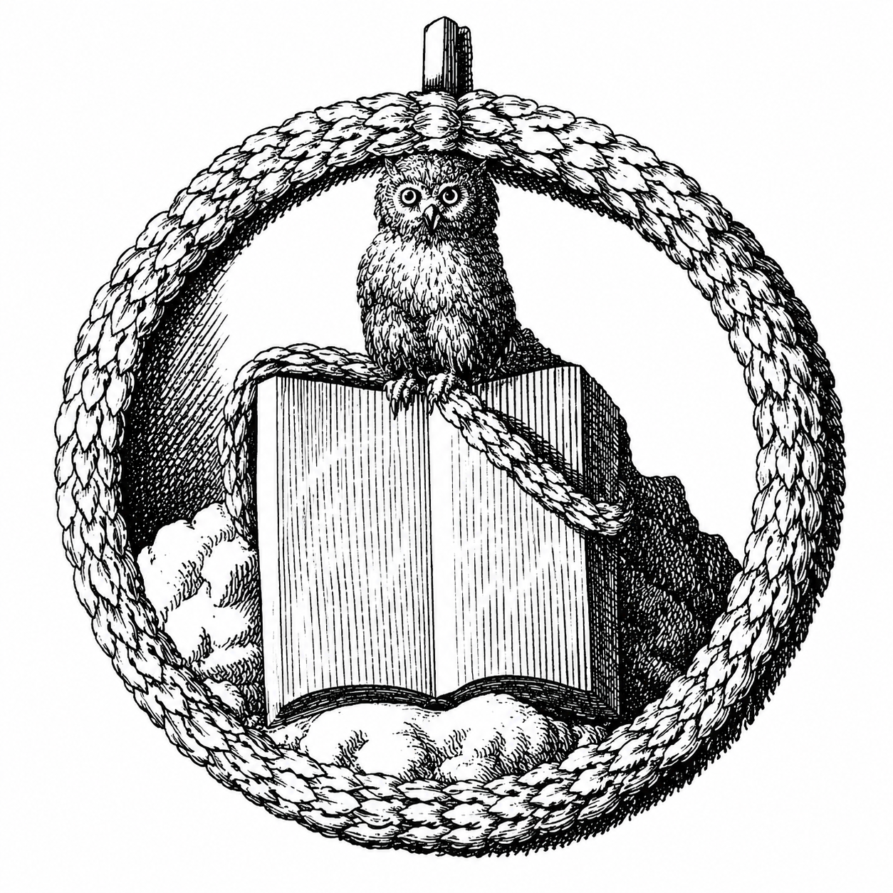

# 🕯️ Illuminatiorden i Bayern (1776–1787)

  
   
  <i>Minerval-emblemet: Minervas uggla på en uppslagen bok. Modern reproduktion av 1788 års design — det äkta periodtrycket finns i <a href="bilder/">bilder/</a>.</i>

**En källbelagd svensk kunskapsbas om den *historiska* bayerska Illuminatiorden** — det upplysningssällskap som Adam Weishaupt grundade den 1 maj 1776 i Ingolstadt. Basen är byggd på ordens *egna* beslagtagna och publicerade skrifter, med primärkällor transkriberade och översatta till svenska.

> 🇬🇧 **English summary:** A source-based Swedish knowledge base on the *historical* Bavarian Illuminati (1776–1787). It reconstructs the order from its own seized and published documents — statutes, the initiation oath, Weishaupt's letters, and the complete grade rituals — transcribed from period facsimiles and translated into Swedish, with every source's reliability graded and the modern conspiracy myth kept strictly separate.

---

## ⚠️ Viktig avgränsning: historia, inte konspiration

Detta är **historia**, inte konspirationsteori. Den verkliga orden var ett kortlivat, tyskt upplysningssällskap som i praktiken var upplöst omkring 1787–1790. Den moderna myten om en världsstyrande "Illuminati" behandlas i ett **eget, tydligt åtskilt** dokument: [10 – Historia kontra myt](10-historia-vs-myt.md).

Genomgående gäller: äkta primärkälletext ges ordagrant *och* i sitt sammanhang; mytologiskt laddade passager förklaras källkritiskt; och ingenting är påhittat — där en text inte kunnat verifieras sägs det rakt ut.

---

## Om projektet

Målet var att gå bortom encyklopediska sammanfattningar och **rekonstruera orden ur dess egna handlingar**. Basen kombinerar:

- **13 tematiska dokument** — en sammanhängande historik (grundande, ideologi, organisation, medlemmar, frimureri, spridning, fall, eftermäle, myt).
- **7 översatta primärkälletexter** — ordens faktiska stadgar, invigningsed, Weishaupts brev och samtliga gradritualer, med **tysk originaltext bredvid den svenska översättningen**.
- **4 kompletta facsimil-PDF:er** — de digitaliserade originaltrycken (1787–1794) som allt bygger på.
- **Äkta bildmaterial** — ordens verkliga emblem ur 1788 års systembok (inget modernt konspirationsskräp).
- **En 87-sidig PDF-export** av hela basen.

Allt är skrivet på svenska, korslänkat (fungerar som ren markdown och i **Obsidian**), och källkritiskt märkt.

---

## 📚 Innehåll

### Tematiska dokument

| # | Dokument | Beskrivning |
|---|----------|-------------|
| 01 | [Översikt & tidslinje](01-oversikt.md) | Sammanfattning och tidslinje 1748–1830 |
| 02 | [Adam Weishaupt](02-adam-weishaupt.md) | Grundaren (*Spartacus*) |
| 03 | [Ideologi och mål](03-ideologi-och-mal.md) | Upplysning, förnuft, perfektibilism |
| 04 | [Organisation & grader](04-organisation-och-grader.md) | Hierarki, de 12 graderna, ritualer, symboler |
| 05 | [Medlemmar](05-medlemmar.md) | Nyckelgestalter (dokumenterat kontra legend) |
| 06 | [Frimureriet](06-frimureriet.md) | Infiltration och kongressen i Wilhelmsbad |
| 07 | [Spridning](07-spridning.md) | Geografisk utbredning och medlemsantal |
| 08 | [Förbudet och fallet](08-forbud-och-fall.md) | Edikten, razziorna, upplösningen |
| 09 | [Eftermäle och arv](09-eftermale-och-arv.md) | Ordens historiska betydelse |
| 10 | [Historia kontra myt](10-historia-vs-myt.md) | Hur myten uppstod — och motbevisen |
| 11 | [Källor](11-kallor.md) | Samlad källförteckning och källkritik |
| 12 | [Originaldokument](12-originaldokument.md) | Primärkällornas korpus |
| 13 | [Emblem och symboler](13-emblem-och-symboler.md) | Äkta bildmaterial |
| 14 | [Ordens koppling till religion](14-religion.md) | Antiklerikal deism, den dolda religionskritiken, Jesus-tolkningen |
| 15 | [Frimureriet och religionen](15-frimureriet-och-religionen.md) | Varför förknippas de trots religionen? |
| 16 | [Kvinnor och orden](16-kvinnor-och-orden.md) | Uteslutning, instrumentell syn, den obefintliga kvinnliga grenen |
| 17 | [Koder, chiffer och hemlighetsmakeri](17-koder-chiffer-hemlighetsmakeri.md) | Täcknamn, kodade ortnamn, kalendern, sigillen |
| 18 | [Ekonomi och finansiering](18-ekonomi-och-finansiering.md) | Avgifter, fattigunderstöd, decentraliserad kassa |
| 19 | [Utbildnings- och studiesystemet](19-utbildnings-och-studiesystemet.md) | Läskanon, Minervalakademier, självstudier |
| 20 | [Övervakning och kontroll](20-overvakning-och-kontroll.md) | Själsspioneriet — Quibus Licet, dossierer, kompartmentalisering |

### Översatta primärkällor — [`primarkallor/`](primarkallor/)

Ordens faktiska ordalydelse, tysk originaltext bredvid svensk översättning, med tillförlitlighetsbetyg per källa. Se [läsanvisningen](primarkallor/README.md).

| Dok | Källa | Innehåll | Tillförlitlighet |
|-----|-------|----------|------------------|
| [01](primarkallor/01-einige-originalschriften.md) | *Einige Originalschriften* (1787) | Stadgar, Revers, **invigningsed**, värvningsinstruktioner | Måttlig (OCR) |
| [02](primarkallor/02-verbesserte-system.md) | *Das verbesserte System* (1787) | Weishaupts reformerade 8-klassystem + metafysik | Måttlig (OCR) |
| [03](primarkallor/03-grader-och-ritualer.md) | Faber 1788 / Grolmann 1794 | Grad- och ritualtext | God (OCR) |
| [04](primarkallor/04-stadgarna-fullstandiga.md) | Engel 1906 (korrekturläst) | **Fullständiga stadgar** + areopagens beslut 1781 | **Hög** |
| [05](primarkallor/05-spartacus-breven.md) | Originalschriften / Markner | **Weishaupts egna brev** | God |
| [06](primarkallor/06-nachtrag.md) | *Nachtrag* (1787) | Gradplan + **Dirigens-gradens tal** + organisation | God/måttlig |
| [07](primarkallor/07-ritualer-hogupplost.md) | Facsimil (**Claude-vision**) | **Samtliga gradritualer** — novis→regent, tecken-för-tecken | Högst |

### Facsimiler — [`facsimiler/`](facsimiler/)

De kompletta originaltrycken som sidbilder (PDF). Se [`facsimiler/README.md`](facsimiler/README.md).

- **Faber 1788**, *Der ächte Illuminat* — första klassens ritualer
- **Grolmann 1794**, *Die neuesten Arbeiten des Spartacus und Philo* — Präst- och Regentgraderna
- **Einige Originalschriften** (1787) och **Nachtrag** (1787) — stadgar, ed, korrespondens

### Bilder — [`bilder/`](bilder/)

Äkta 1700-talsemblem (Minerval-ugglan ur *Das verbesserte System*, 1788). Moderna reproduktioner hålls strikt åtskilda i [`bilder/reproduktioner/`](bilder/reproduktioner/).

### 📄 PDF-export

**[`Illuminatiorden-kunskapsbas.pdf`](Illuminatiorden-kunskapsbas.pdf)** — hela basen samlad (87 sidor, med innehållsförteckning, tvåspråkiga citatblock och inbäddade bilder).

---

## 🔍 Metod och tillförlitlighet

Basen byggdes i lager, med **hederligheten explicit**:

1. **Historik** — sammanställd ur uppslagsverk, akademisk litteratur (Le Forestier 1914, van Dülmen, Melanson 2009) och seriös journalistik.
2. **Primärkällor** — ordens beslagtagna och 1787 publicerade skrifter, plus Weishaupts försvarsskrifter och Grolmanns avslöjanden 1794.
3. **Transkription** — de kompletta gradritualerna är lästa **tecken-för-tecken ur sidbilderna** med Claude-modellens bildläsning (multimodalt), vilket ger renare fraktur-läsning än maskinell OCR.

Varje källa märks med **tillförlitlighet** (korrekturläst > visionläst > OCR), och osäkra uppgifter flaggas genomgående (t.ex. medlemskap för Goethe/Herder, Lanz/Lang-episoden, de persiska månadsnamnen, de högsta mysterierna). Det berömda "hemlighetscitatet" som cirkulerar överallt visas vara **John Robisons parafras (1798)**, inte Weishaupts ord — med den genuina texten bredvid.

---

## Snabbfakta

- **Grundad:** 1 maj 1776, Ingolstadt, Kurfurstendömet Bayern
- **Grundare:** Adam Weishaupt (1748–1830), professor i kanonisk rätt, täcknamn *Spartacus*
- **Ursprungligt namn:** *Bund der Perfektibilisten* (Perfektibilisternas förbund)
- **Organisatör:** Adolph Knigge (*Philo*), som från 1780 ympade ett frimurerskt gradsystem på orden
- **Storlek:** ~650 dokumenterade medlemmar 1784; ~1 394 identifierade totalt
- **Förbjuden:** Genom kurfurst Karl Theodors edikt 1784–1787
- **Status:** Historiskt upplöst omkring 1787–1790

---

## Så här läser du basen

- **På GitHub:** klicka i innehållsförteckningen ovan.
- **I Obsidian:** öppna mappen som ett valv — de interna `[[wikilänkarna]]` blir klickbara.
- **Som PDF:** [`Illuminatiorden-kunskapsbas.pdf`](Illuminatiorden-kunskapsbas.pdf).

## Bygga PDF:en själv

Verktygen finns i [`verktyg/`](verktyg/) (kräver `pandoc` + `weasyprint`). Se [`verktyg/README.md`](verktyg/README.md).

---

## 📜 Licens

- **Text, översättningar och sammanställning:** [Creative Commons Erkännande 4.0 (CC BY 4.0)](LICENSE) — fri att dela och bearbeta med angivande av källa.
- **Primärkällor och 1700-talsbilder:** public domain (upphovsrätten utgången).

Se [`LICENSE`](LICENSE) för detaljer.

## Erkännanden

Sammanställd med hjälp av Claude Code. Byggd på arbete av bland andra René Le Forestier, Richard van Dülmen, Terry Melanson, Reinhard Markner m.fl., och på de digitaliserande institutionerna Internet Archive, SLUB Dresden och Bayerische Staatsbibliothek (MDZ).
